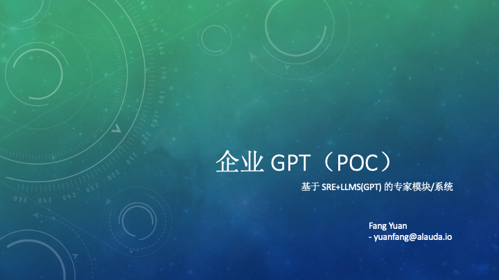
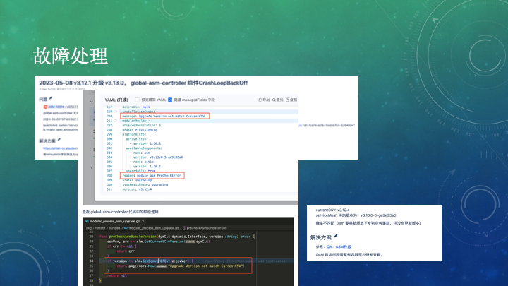
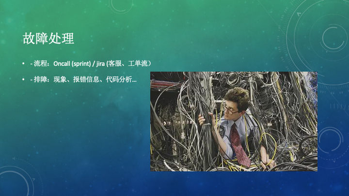
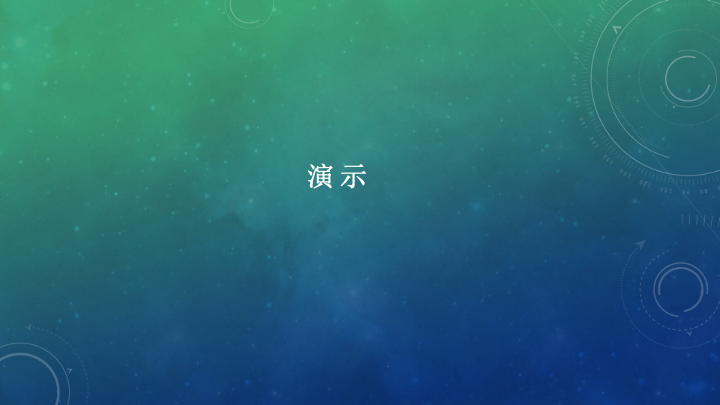
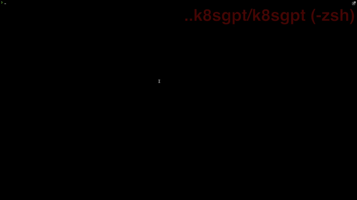
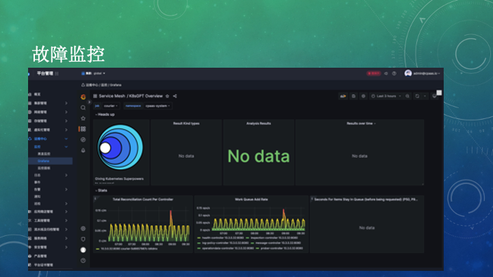
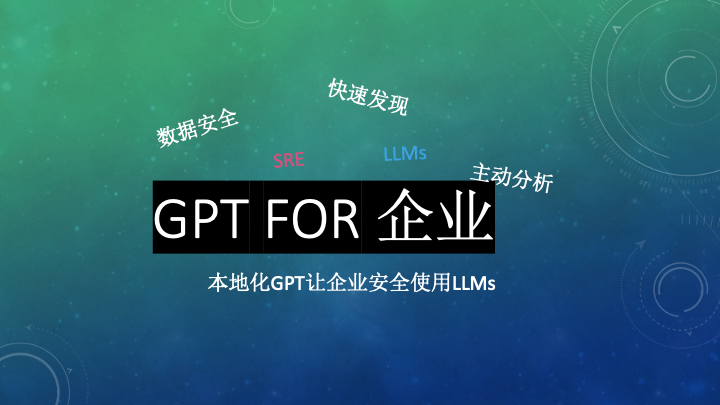

# hackathon2023

## 企业GPT

简而言之：

一个 kubernetes 环境中，基于 SRE 和 LLMs 技术生态的“企业GPT”产品探索POC（本演示以故障检查场景为例）
- 数据安全
  -  数据不出机房，可以视需求完全运行在企业内部或者连入更强大的在线大模型
- 主动异常检测
  - 针对k8s 资源、事件等多维度数据源侦测（目前采用基于k8sGPT 实现，可根据需求扩充）
- SRE专家库
  - 基础设施中建立 SRE 专家经验库（故障库、知识库），便于运维知识、经验的迭代和传播，提炼价值

它不是：

- 不是开箱即用万能的“运维之神”
  - 不要误解有了 chatgpt 就无所不能了（在专业领域有深度的问题，或者自研产品的相关知识、故障错误等等，它不会比你自己了解的更多）
  - 对于通用类的报错信息，他可能给得出处理建议的。但也仅限于在训练中习得过类似的内容（否则就是很有逻辑的废话，你懂的~）
  
PPT

